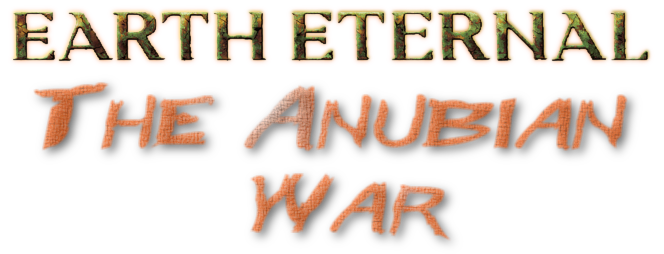

# Developer Documentation

 

## Introduction

This page is intended to help new Earth Eternal developers get up to speed when starting to work on
the project.

It is separated into different sections, depending on your primary role.

Each section will describe the tools you will be expected to use to fulfil your role.

## Coders

### Tools

 * Git. All game source is stored in the Git SCM. At the moment, this is all hosted on GitHub.
   You should make yourself familiar with at least the basic of Git, including but not limited
   to cloning, pushing, pulling and resolving conflicts.
   
 * In-game world editor. While you are likely to use this less than say a World Builder, you 
   should at least familiarise yourself with how props and spawns are arranged in the world.
   
 * C++ Compiler. The server, and part of the client are coded in C++. GCC is currently recommended.
 
 * Editor. You will need a source code editor. You may choose any editor you wish, ideally one with
   syntax highlighting and other language features for C++ and Squirrel scripts.
   
 * Java runtime. Some tools used to compile client assets into deployable packages are written in Java.
 
 * Python. Used by the Meson build system.
 
 * Meson Build System and Ninja for next generation 'master' branch of server, and the refactored SparkPlayer platform.
 
 * Automake, but only if working on the legacy valkals_shadow branch.
 
 * Maven. A java build system, used to build the Java asset compilers.
 
 * Ant. A javabuild system, used to build the assets.
 
 * Redis. Used as a structure data store and message broker for clustering (shards). Note, not used
   in legacy branch.
   
 * OGRE. Open Graphics Rendering Engine. A C++ game engine, on which SparkPlayer is based. 
 
 * Boost C++ Libraries. Used in both client (SparkPlayer) and server (TAWD).
   
### Languages

 * C++ for the server and the SparkPlayer client platform.
 
 * Squirrel, for the client game user interface and logic as well as for server side AI scripts.  
 
 * Java. If working with the compiler tools (modifying, not just using them).
 
### Architecture

It will help to understand the architecture of the various components of the entire Earth Eternal
suite.

## Modellers 

TODO

## Texture Artists

TODO

## Writers

TODO   

## World Builders

TODO