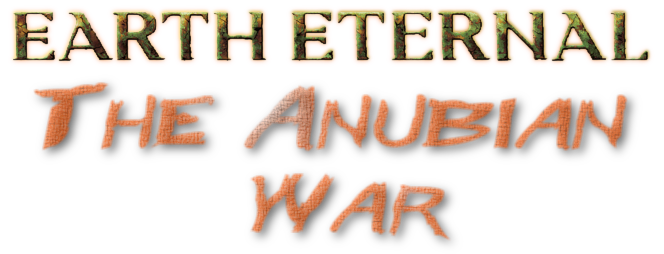

# About TAWD - An Earth Eternal Server

 

## Quick Start

 * You just want to [Play](https://www.theanubianwar.com/valkals-shadow) The Game.
 * You want to [Run Your Own Server](Doc/SERVER.md)
 * You are a developer who want to [Build From Source](Doc/BUILD.md)

## History

Earth Eternal is an abandoned MMORPG published and run by Sparkplay Media from 2007 to 2010. Since then it has been in various hands, but never achieved mainstream success. 

During this time, an enterprising player managed to develop an alternative server which was eventually brought online as a private server enjoyed by a small community for a few years before he stood down. At this point he released the source to the community to do with as they will. For a full history, see our website, [theanbubianwar.com](https://www.theanubianwar.com).  

This is the Git repository for the server data and source for TAWD, the continuation of the IceEE project (SOAD, VALD), which itself is a continuation Grethnefar's Planetforever Server. Changes on the dev server will periodically be pushed to this, as will changes by developers and their local server. 
 
### New Features
 
 In addition to the large number of changes in the earlier IceEE servers, TAWD is an attempt to address
 some architectural problems, add new mechanics and web site integration and more.
 
  * All user data now stored in a Redis instance (https://redis.io). This is key-value database with
    built-in high availability and clustering. 
  * Shards are implemented. Redis provides a pub/sub messaging API that is used to achieve this.
  * HTTP server component replaced with CivetWeb, an embeddable C/C++ HTTP server. This brings HTTPS support
    and other performance, scalibity, security and maintenance advantages. 
  * Replaced logging system with easylogging.
  * New quest mechanics (ad-hoc quests, 'outcomes').
  * Abstracted message / query system.
  * Clan support.
  * Improved Grove Tools.
  * Ported to other architectures (Arm, e.g. Raspberry Pi).
  * HTTP API for website integration.
  * Other tidying.
  * New Meson based build.
  * Improved developer tools.

### Credits

Many thanks to all those involved in making this game, and keeping it alive.

 * Grethnefar - Original programming. The Rebuilder.
 * Emerald Icemoon - Programming, content and admin
 * Heathendel Dustrunner - Quest, content and battle design and more.
 * Rictar Gasper - World building
 * Liska Quicksilver - Quest design and Lore Master
 * And all the other IGF contributors
 
#### Audio

Credits for additional audio content added to the game.

*Gloom Horizon* - Ambient music used in Grunes Tal undead region

*Crossing The Chasm* - Ambient music used in Swineland region

*Dark Times* - Activate music used in Bloodkeep

*Land Of Phantoms* - Ambient music used in Bloodkeep

*Some Amount Of Evil* - Ambient music used in Bloodkeep

*Killers* - Ambient music used in penultimate fight scene in Bloodkeep

*Chee Zee Cave* - Music used in Southend Passage

*Night Cave* - Music used in Forest Cave

*Curse Of The Scarab* - Music used in Djinn Temple

*Dragon And Toast* - Music used in Fangarian's Lair

*Grim Idol* - Fight Music used in Fangarian's Lair

*The Hive* - Background Music used in Skrill Queen Lair

*Constance* - Fight Music used in Skrill Queen Lair

*Christmas Rap* - Ambient music used for Winter Dawning region

*Wish Backgroud*  - Ambient music used for Winter Dawning region

Kevin MacLeod (incompetech.com)
Licensed under Creative Commons: By Attribution 3.0
http://creativecommons.org/licenses/by/3.0/

*Tap* - Finale in Valkal's Bloodkeep
Music: Alexander Nakarada (www.serpentsoundstudios.com)
Licensed under Creative Commons: By Attribution 4.0 License
http://creativecommons.org/licenses/by/4.0/

Lots of sound effects used as background or spot effects throughout the
game came from freesound.org. All of these are 
Licensed under Creative Commons: By Attribution 3.0

*Forest Evening* - cediez - https://www.freesound.org/people/cediez/ 

*Kankbeeld Horror Pack* - Kankbeeld - http://www.freesound.org/people/klankbeeld/

*Dungeon Ambiance* - https://freesound.org/people/phlair/sounds/388340/

*Lava loop* - Audionautics - https://freesound.org/people/Audionautics/sounds/133901/

*Dripping Cave* - dobroide - https://freesound.org/people/dobroide/sounds/396314/

*Thunder Pack* - hantorio - https://freesound.org/people/hantorio/packs/7640/ 

*10 Second Countdown* - thomasevd - https://freesound.org/people/thomasevd/sounds/202193/

 And some from https://tabletopaudio.com
 Creative Commons Attribution-NonCommercial-NoDerivatives 4.0 International License.

*In The Shadows* - Ambient background 